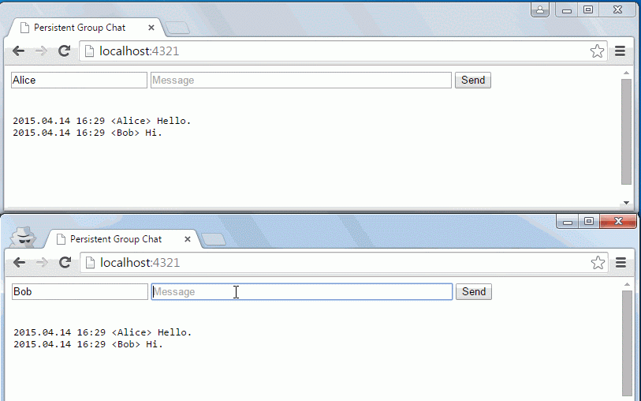

kchat
=====

Persistent group chat. Server uses kdb+/k/q web sockets, client is static JS/HTML/CSS; less than 50 lines for both.

Dependencies
------------
- [kdb+/k/q](http://kx.com/software-download.php)

To run
------
1. Drop chat.htm, index.txt, and chat.q or chat.k in the q directory.

2. Start the kdb+/k/q web socket server:
	- Linux: /path/to/q/l32/q chat.k -p 80
	- Windows: /path/to/q/w32/q chat.k -p 80

3. Browse to http://localhost
